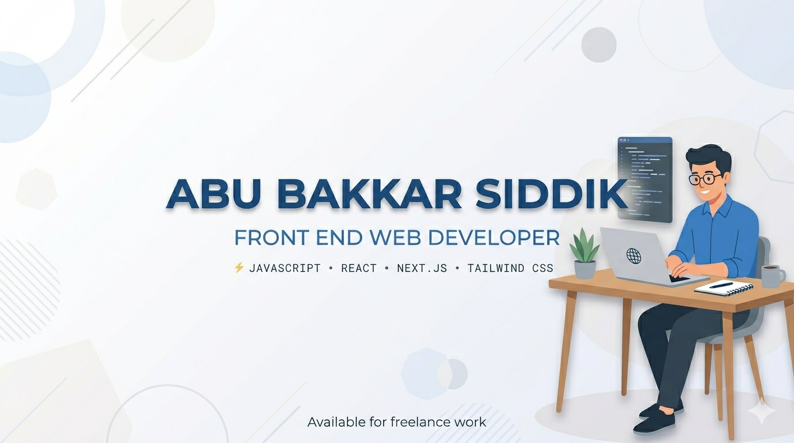
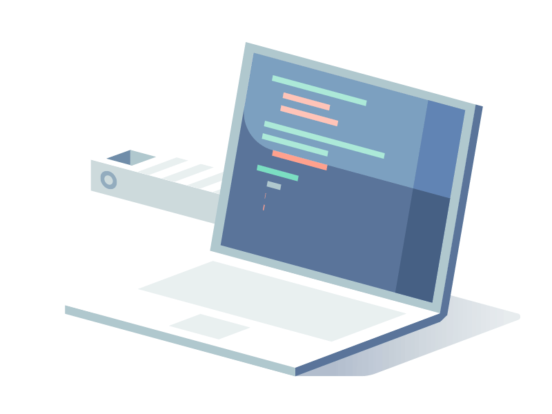

<h1 align="center">
  <a href="https://git.io/typing-svg">
    
  </a>
</h1>


<div align="center">
  <strong>Frontend Web Developer 👋 | Expert in JavaScript, React.js, Next.js, Tailwindcss|</strong>
</div>
<br/>
<div align="center">
  <a href="www.linkedin.com/in/abubakkarsiddik07"></a>
  <a href="https://app.daily.dev/abubakkarsiddik123"></a>
  <a href="https://abubakkarsiddik123.github.io/my-website-code/"></a>
  <a href="https://x.com/NurAdnanChowdhu"></a>
</div>
<hr/>


### Talking about Personal Stuff:

- 🛠 &nbsp; I’m currently working with <strong>JS, TS, React, Node, Express MongoDB, SQL & AWS.</strong>
- 🚀 &nbsp; I’m currently exploring <strong>Golang, Blockchain, Rust, Solidity, Solana.</strong>
- 📫 &nbsp; Reach me out: <strong>nuradnanchowdhury015@gmail.com.</strong>

### My Absolute Favorites:
- 💻 &nbsp; I love exploring new technologies and building cool stuff.
- 🍕 &nbsp; Meetups & Tech Events & Hackathons.

<hr/>

<h2 align="center">🔥 Languages & Frameworks & Tools 🔥</h2>

<div align="center">
  <code></code>
  <code></code>
  <code></code>
  <code></code>
  <code></code>
  <code></code>
  <code></code>
  <code></code>
  <code></code>
  <code></code>
  <code></code>
  <code></code>
  <code></code>
  <code></code>
  <code></code>
  <code></code>
</div>

<br/>

```javascript
const nurAdnan = {
  pronouns: "he/him",
  code: ["JavaScript", "TypeScript", "HTML", "CSS", "Tailwind CSS"],
  tools: ["React", "Redux", "Next", "Node.js", "Styled-Components", "Jest", "Docker", "Kubernetes"],
  architecture: ["microservices", "event-driven", "design system pattern"],
  techCommunities: {
    coorganizer: "East-West-University",
    speaker: "English",
    mentor: "Web Developer"
  },
  challenge: "I am doing the #100DaysOfCode challenge focused on React and TypeScript"
}
```

